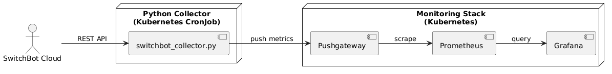
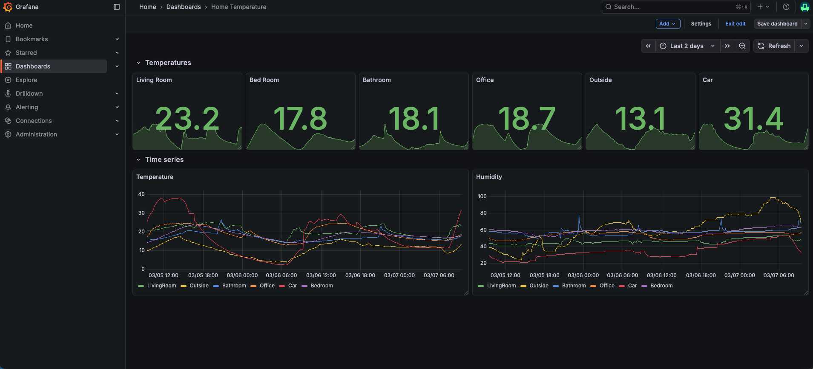

# SwitchBot IoT Monitoring with Kubernetes

## Overview

This project collects temperature and humidity data from SwitchBot devices and visualizes them using Prometheus and Grafana.

It demonstrates an end-to-end monitoring pipeline running on Kubernetes.

## Architecture

SwitchBot API → Python Collector → Pushgateway → Prometheus → Grafana



## Features

* Containerized Python data collector
* Kubernetes CronJobs for scheduled metric collection
* Prometheus Pushgateway integration
* Multi-device metric labeling
* Grafana dashboards for visualization
* Error handling and structured logging
* Local development workflow with Podman
* Kubernetes-native deployment design


## Tech Stack

* Python (requests, prometheus_client)
* Kubernetes (CronJobs, Services, Pods)
* Prometheus + Pushgateway
* Grafana
* Podman / containerd
* Ubuntu Linux

## Repository Structure

```
switchbot-monitoring/
├── collector/        # Python collector and container build files
├── k8s/              # Kubernetes manifests
├── docs/             # Architecture diagrams and screenshots
└── README.md
```

## Running Locally

### Deploying the prometheus stack
Monitoring stack deployed via kube-prometheus-stack Helm chart, including Prometheus Operator, Alertmanager, and Grafana.

### Build the container

```
podman build -t switchbot-collector .
```

### Run the collector

```
podman run --rm \
  -e SWITCHBOT_TOKEN=YOUR_TOKEN \
  -e DEVICE_ID=YOUR_DEVICE \
  -e LOCATION=Test \
  -e PUSHGATEWAY_URL=http://localhost:9091 \
  switchbot-collector
```

### Deploy to Kubernetes

```
kubectl apply -f k8s/
```

## Dashboard Preview

Example Grafana dashboards showing temperature and humidity trends:




## Challenges & Lessons Learned

* Designing reliable Kubernetes CronJobs
* Handling intermittent API failures
* Understanding Prometheus metric freshness
* Debugging container networking
* Managing local container images in Kubernetes
* Modeling time-series data effectively

This project strengthened my understanding of real-world observability pipelines.

## Challenges & Lessons Learned

* Log collection using Splunk
* Designing reliable Kubernetes CronJobs
* Handling intermittent API failures
* Understanding Prometheus metric freshness
* Debugging container networking
* Managing local container images in Kubernetes
* Modeling time-series data effectively

This project strengthened my understanding of real-world observability pipelines.
