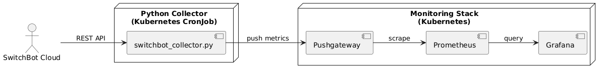

# SwitchBot IoT Monitoring with Kubernetes

## Overview

This project collects temperature and humidity data from SwitchBot devices and visualizes them using Prometheus and Grafana.

It demonstrates an end-to-end monitoring pipeline running on Kubernetes.

## Architecture

SwitchBot API → Python Collector → Pushgateway → Prometheus → Grafana



## Features

* Containerized Python data collector
* Kubernetes CronJobs for scheduled metric collection
* Prometheus Pushgateway integration
* Multi-device metric labeling
* Grafana dashboards for visualization
* Error handling and structured logging
* Local development workflow with Podman
* Kubernetes-native deployment design


## Tech Stack

* Python (requests, prometheus_client)
* Kubernetes (CronJobs, Services, Pods)
* Prometheus + Pushgateway
* Grafana
* Podman / containerd
* Ubuntu Linux

## Repository Structure

```
switchbot-monitoring/
├── collector/        # Python collector and container build files
├── k8s/              # Kubernetes manifests
├── docs/             # Architecture diagrams and screenshots
└── README.md
```

## Running Locally

### Deploying the prometheus stack
Monitoring stack deployed via kube-prometheus-stack Helm chart, including Prometheus Operator, Alertmanager, and Grafana.

### Build the container

```
podman build -t switchbot-collector .
```

### Run the collector

```
podman run --rm \
  -e SWITCHBOT_TOKEN=YOUR_TOKEN \
  -e DEVICE_ID=YOUR_DEVICE \
  -e LOCATION=Test \
  -e PUSHGATEWAY_URL=http://localhost:9091 \
  switchbot-collector
```

### Deploy to Kubernetes

```
kubectl apply -f k8s/
```

## Shelly H&T Gen3 MQTT collector

The separate collector in `collector/shelly/` continuously reads MQTT notifications
from the existing `mosquitto:1883` service. It writes one JSON object per accepted
`NotifyFullStatus` message to stdout, with diagnostics on stderr. It does not send
data to Splunk or Pushgateway, and does not change Mosquitto.

MQTT does not allow partial-level wildcards: `shellyhtg3-+/events/rpc` is invalid.
The collector subscribes to `+/events/rpc` and locally accepts only topics shaped
like `shellyhtg3-000000000001/events/rpc`. `device` is the first topic level.
Temperature, humidity, RSSI, and the device's Unix timestamp are preserved as
numbers. Missing or invalid numeric fields cause the notification to be skipped
with a warning. `collector_received_at` records receipt in UTC ISO 8601.

Example stdout (one line):

```json
{"device":"shellyhtg3-000000000001","temperature_c":22.5,"humidity_pct":48,"wifi_rssi":-62,"device_ts":1790856000.5,"collector_received_at":"2026-10-01T12:00:00+00:00"}
```

Build with the Shelly directory as the build context:

```bash
podman build -t localhost/shelly-collector:1.0 collector/shelly
```

The manifest follows the existing local-image convention (`imagePullPolicy:
Never`). Load the image into the container runtime on every eligible Kubernetes
node before deploying. For example, for a local containerd cluster:

```bash
podman save --format docker-archive -o /tmp/shelly-collector.tar localhost/shelly-collector:1.0
sudo ctr -n k8s.io images import /tmp/shelly-collector.tar
```

For a registry-based cluster, push the image and update the manifest's image and
pull policy instead. Deploy into the **same namespace as Mosquitto**, since
`mosquitto` resolves within the pod's namespace. The new manifest, like the
existing Mosquitto manifest, does not hard-code a namespace:

```bash
kubectl -n YOUR_MOSQUITTO_NAMESPACE apply -f k8s/monitoring/shelly-collector-deployment.yaml
kubectl -n YOUR_MOSQUITTO_NAMESPACE rollout status deployment/shelly-collector
kubectl -n YOUR_MOSQUITTO_NAMESPACE logs -f deployment/shelly-collector
```

The Deployment runs one replica with `Recreate` updates to avoid overlapping
collectors during a rollout. It reconnects with backoff and resubscribes after
connections are restored. MQTT delivery may include duplicates; there is no
durable buffering or deduplication. Messages published while disconnected may
be missed. SIGTERM disconnects the MQTT client for pod shutdown.

`MQTT_HOST` and `MQTT_PORT` override the defaults (`mosquitto` and `1883`).
For local execution, use a virtual environment and a reachable broker address:

```bash
python3 -m venv .venv
.venv/bin/pip install -r collector/shelly/requirements.txt
MQTT_HOST=localhost MQTT_PORT=31883 .venv/bin/python collector/shelly/collector.py
```

Run the focused tests without installing MQTT dependencies:

```bash
PYTHONDONTWRITEBYTECODE=1 PYTHONPATH=collector/shelly python3 -m unittest discover -s collector/shelly/tests -v
```

## Grafana Dashboard

The Grafana dashboard used in this project is included in this repository.

To import it:

1. Open Grafana
2. Go to **Dashboards → Import**
3. Upload `grafana/home_temperature_dashboard.json`


## Challenges & Lessons Learned

* Designing reliable Kubernetes CronJobs
* Handling intermittent API failures
* Understanding Prometheus metric freshness
* Debugging container networking
* Managing local container images in Kubernetes
* Modeling time-series data effectively

This project strengthened my understanding of real-world observability pipelines.

## Challenges & Lessons Learned

* Log collection using Splunk
* Designing reliable Kubernetes CronJobs
* Handling intermittent API failures
* Understanding Prometheus metric freshness
* Debugging container networking
* Managing local container images in Kubernetes
* Modeling time-series data effectively

This project strengthened my understanding of real-world observability pipelines.
